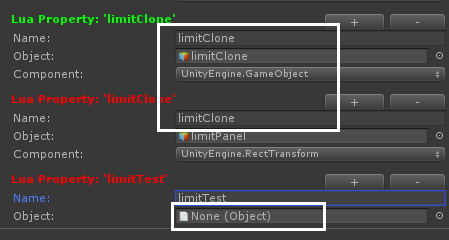

在KSFramework中，提供两种方式进行控件绑定：

1. 通过代码手工实现控件的绑定
2. 通过拖拽的方式绑定(LuaOutlet)

本篇讲解通过拖拽实现控件的绑定

拖拽绑定控件有以下几个规则：

在当前UI中，不允许出现相同的Name，否则Name用红色提示，因为用Name做的key

当Object为空时(未赋值)，用红色进行提示

## LuaOutlet 拖拽绑定控件

在KSFramework中，可以在Editor中编辑UI的时候绑定控件，然后在UI代码可以直接使用self.xxx进行引用，

比如：self.txtTips，就指向txtTips这个Object，类型为UnityEngine.UI.Text


每组包含三个变量：

```lua
Name：在Lua代码访问的变量名
Object：指向Unity的Object
ComponentType：Unity中的type，下拉列表可选择你需要的Type
```

## 在代码里引用拖拽的控件

在Editor中对控件绑定之后，在UI代码可以直接使用self.xxx进行引用，比如：

```Lua
self.txtTitle = "标题文字"
self.btnLogin.onClick:RemoveAllListeners()
```

txtTitle和btnLogin 是在OnInit中对变量进行赋值，调用luaTable.Set，压入self作用域中。

实现代码可查看：**LuaUIController.SetOutlet**

## 可视化查找引用丢失

在代码中通过路径查找控件，而如果这个控件后来因UI的结构修改而被删除了，这个变量就变成了Null。 程序对变量的访问就会引发NullReferenceException。 这种问题出现的时候，非常的不好查。

而如果outlet则提供可视化的方法查找，在Inspect面板会**以红色标识丢失的引用，或者同名的变量**。



## 多个outlet

当UI界面比较复杂时，如果全部的控件都绑定在一个outlet，那么后续的维护成本大，不易查找到指定的控件。，我建议是界面的*每个块级元素*使用一个outlet，或者以某个功能点划分，或者以区域划分(顶部，中部，左侧，右侧)，每个界面由多个outlet组成一个LuaOutletCollection

