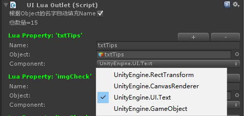

在KSFramework中，提供两种方式进行控件绑定：

1. 通过代码手工实现控件的绑定
2. 通过拖拽的方式绑定(LuaOutlet)

本篇对这两种绑定方式进行对比。


## 手工代码绑定

技术同学在代码中完成控件绑定，而不需要去手动拖拽。

```lua
-- Type and Path
local button = self:GetControl('UnityEngine.UI.Button', 'path1/path2/button')
```


## LuaOutlet 拖拽绑定控件

在KSFramework中，可以在Editor中编辑UI的时候拖拽绑定控件，然后在UI代码中使用self.xxx进行引用，

比如：self.txtTips，就指向txtTips这个Object，类型为UnityEngine.UI.Text

```lua
self.txtTips.text = "这是给文本赋值"
```





### 可视化查找引用丢失

在代码中通过路径查找控件，而如果这个控件后来因于UI的结构修改而被删除了，或者美术、策划调整了UI层级结构，这个路径就找不到对应的控件，从而变量变成了Null， 程序对变量的访问就会引发NullReferenceException。 如果经常出现这种问题的话，让技术同学去检查路径是一种浪费不必要的时间。

而outlet则提供可视化的方法，在Inspect面板会**以红色标识丢失的引用，和具有同名的变量**。


## 总结

如果是从代码的可读性来讲，那么工程师喜欢使用代码手工实现控件绑定。

如果对于策划或美术同学的可视化操作来讲，那么策划师和设计师喜欢拖拽实现控件绑定。